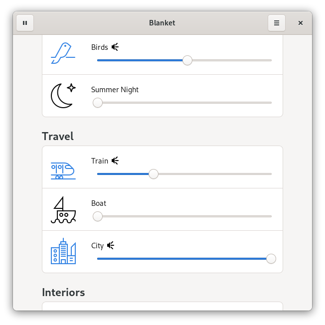

<h1 align="center">
	<br>
	Blanket
</h1>

[](https://stopthemingmy.app) 
[](https://github.com/rafaelmardojai/blanket/blob/master/COPYING)
[](https://paypal.me/RafaelMardojaiCM)
[](https://liberapay.com/rafaelmardojai/donate)

<p align="center"><strong>Listen to different sounds</strong></p>

<p align="center">
  <a href="https://flathub.org/apps/details/com.rafaelmardojai.Blanket"></a>
</p>

<p align="center">
  
</p>


## Description
Improve focus and increase your productivity by listening to different sounds. Or allows you to fall asleep in a noisy environment.

## Third Party Packages 

| Distribution | Package | Maintainer |
|:-:|:-:|:-:|
| Alpine Linux (edge) | [`blanket`](https://pkgs.alpinelinux.org/packages?name=blanket) | mio |
| Arch Linux (community) | [`blanket`](https://archlinux.org/packages/community/any/blanket/) | [Balló György](https://github.com/City-busz) |
| Fedora (Copr) | Copr: [`tuxino/blanket`](https://copr.fedorainfracloud.org/coprs/tuxino/blanket/), package: `blanket` | Tuxino |
| NixOS | [`blanket`](https://search.nixos.org/packages?channel=unstable&show=blanket&from=0&size=50&sort=relevance&type=packages&query=blanket) | onny |
| openSUSE  | [`blanket`](https://build.opensuse.org/package/show/multimedia%3Aapps/blanket) | [Michael Vetter](https://github.com/jubalh) |
| Ubuntu (PPA) | [`Stable Releases`](https://launchpad.net/~apandada1/+archive/ubuntu/blanket), [`Daily Builds`](https://launchpad.net/~apandada1/+archive/ubuntu/blanket-daily) | [Archisman Panigrahi](https://github.com/apandada1) |
| MX Linux | [`blanket`](http://mxrepo.com/mx/repo/pool/main/b/blanket/) | [SwampRabbit](https://github.com/SwampRabbit) |

## Build from source

- You can clone and run from GNOME Builder.

### Requirements

| Dependency                           | RPM Package          | Debian Package               | Arch Package
|:-:                                   |:-:                   |:-:                           | :-:
| meson (>= 0.50)                      | `meson`              | `meson`                      | `meson`
| ninja                                | `ninja`              | `ninja-build`                | `ninja`
| appstream and glib                   | `libappstream-glib`  | `libglib2.0-dev`,`appstream` | `appstream-glib`
| Python 3                             | `python3`            | `python3`                    | `python`
| libhandy (>= 0.90.0)                 | `libhandy1`          | `libhandy-1-dev`             | `libhandy1` (AUR)
| gstreamer                            | `python3-gstreamer1` | `gir1.2-gst-plugins-bad-1.0` | `gst-python`
| GTK3                                 | `gtk3`               | `gir1.2-gtk-3.0`             | `gtk3`
| PyGObject                            | `python3-gobject`    |                              | `python-gobject`
| Build dependencies <br>for packaging |                      | `gettext`, `pkg-config`      |


- Alternatively, use the following commands to build it with meson.
```bash
meson builddir --prefix=/usr/local
sudo ninja -C builddir install
```
## Credits
Developed by **[Rafael Mardojai CM](https://github.com/rafaelmardojai)** and [contributors](https://github.com/rafaelmardojai/blanket/graphs/contributors).

Thanks to Jorge Toledo for the name idea.

For detailed information about sounds licensing, [check this file](https://github.com/rafaelmardojai/blanket/blob/master/SOUNDS_LICENSING.md).

## Translations
Blanket is translated into several languages. If your language is missing or incomplete, please help to [translate Blanket in Transifex](https://www.transifex.com/rafaelmardojai/blanket/).

## Donate
If you want to support development, consider donating via [PayPal](https://paypal.me/RafaelMardojaiCM).

