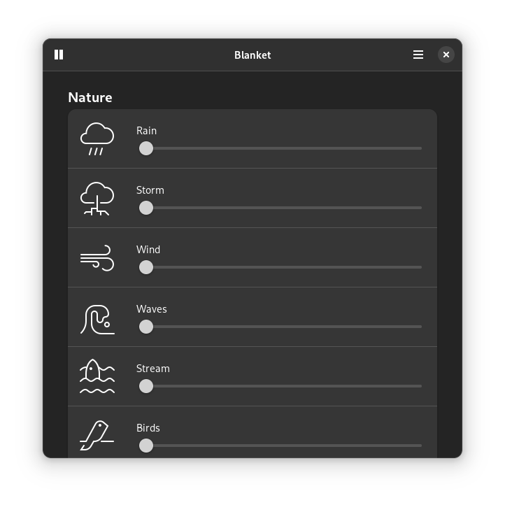

# Blanket

**Listen to different sounds**

<br>

[](https://circle.gnome.org/)
[](https://stopthemingmy.app)

[](https://github.com/rafaelmardojai/blanket/blob/master/COPYING)
[](https://paypal.me/RafaelMardojaiCM)
[](https://liberapay.com/rafaelmardojai/donate)

<p align="center">
  
</p>

## Description
Improve focus and increase your productivity by listening to different sounds. Or allows you to fall asleep in a noisy environment.

## Install

<a href="https://flathub.org/apps/details/com.rafaelmardojai.Blanket"></a>

### Third Party Packages 

| Distribution | Package | Maintainer |
|:-:|:-:|:-:|
| Alpine Linux (edge) | [`blanket`](https://pkgs.alpinelinux.org/packages?name=blanket) | mio |
| Arch Linux (extra) | [`blanket`](https://archlinux.org/packages/extra/any/blanket/) | [Balló György](https://github.com/City-busz) |
| Fedora (Copr) | Copr: [`tuxino/Blob`](https://copr.fedorainfracloud.org/coprs/tuxino/Blob/), package: `blanket` | Tuxino |
| NixOS | [`blanket`](https://search.nixos.org/packages?channel=unstable&show=blanket&from=0&size=50&sort=relevance&type=packages&query=blanket) | onny |
| openSUSE  | [`blanket`](https://build.opensuse.org/package/show/multimedia%3Aapps/blanket) | [Michael Vetter](https://github.com/jubalh) |
| Ubuntu (PPA) | [`Stable Releases`](https://launchpad.net/~apandada1/+archive/ubuntu/blanket), [`Daily Builds`](https://launchpad.net/~apandada1/+archive/ubuntu/blanket-daily) | [Archisman Panigrahi](https://github.com/apandada1) |
| MX Linux | [`blanket`](http://mxrepo.com/mx/repo/pool/main/b/blanket/) | [SwampRabbit](https://github.com/SwampRabbit) |

### Build from source

You can clone and run from GNOME Builder.

#### Requirements

- Python 3 `python`
- PyGObject `python-gobject`
- GTK4 `gtk4`
- libadwaita (>= 1.5.0) `libadwaita`
- GStreamer 1.0 `gstreamer`
- Meson `meson`
- Ninja `ninja`

Alternatively, use the following commands to build it with meson.
```bash
meson builddir --prefix=/usr/local
sudo ninja -C builddir install
```

## Translations
Blanket is translated into several languages. If your language is missing or incomplete, please help to [translate Blanket in Weblate](https://hosted.weblate.org/engage/blanket/).

<a href="https://hosted.weblate.org/engage/blanket/">

</a>

## Credits
Developed by **[Rafael Mardojai CM](https://github.com/rafaelmardojai)** and [contributors](https://github.com/rafaelmardojai/blanket/graphs/contributors).

Thanks to Jorge Toledo for the name idea.

For detailed information about sounds licensing, [check this file](https://github.com/rafaelmardojai/blanket/blob/master/SOUNDS_LICENSING.md).

## Donate
If you want to support my work, you can donate me, [here you can find how](https://rafaelmardojai.com/donate/).

## Related Projects
- [feeltheblow](https://feeltheblow.web.app/) - Web App inspired by Blanket
- [Soothing Noise Player](https://f-droid.org/en/packages/ie.delilahsthings.soothingloop/) - Android app inspired by Blanket
- [Blanket Web](https://apps.roanapur.de/blanket/) - Web clone of Blanket
